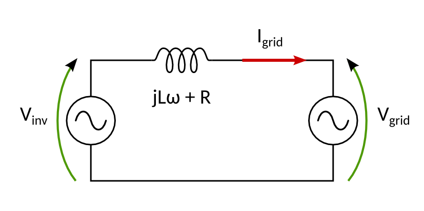
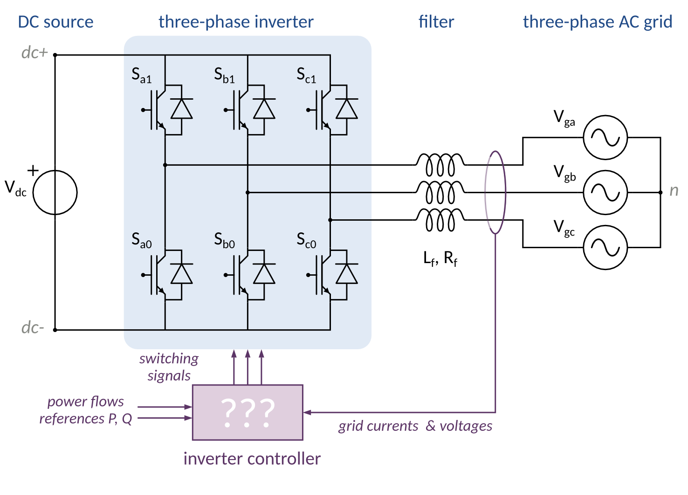

###########################################
Introduction to the Grid Connected Inverter
###########################################

Preamble: AC Power transmission
===============================

Before entering the details of a grid connected inverter, we need to understand
the basic principle of *power transmission between two AC voltage sources*.
To this end, let's study the single-phase circuit represented on  figure XXX.

    
    Power transfer between two voltage source (e.g. an inverter and the grid)
    through an inductive line

The power flow can be explained in sinusoidal regime using
complex representations for the voltages and currents.
These complex amplitudes can then be represented on a  a phasor diagram.
When working with complex currents, it is usual to use a polar notation like
:math:`\underline{I} = Ie^{j\phi}`, with :math:`\phi` the phase shift
with respect to some reference.
However, for reasons that will becomes clearer after, it will be better
to express complex amplitudes in cartesian coordinates
:math:`\underline{I} = I_d + j I_q` [TODO: explain d and q]

.. admonition:: Question
    :class: attention
    
    Relate the active and reactive power transmitted to the grid
    to the current components :math:`I_d, I_q`.

For a given grid voltage, the current flowing between the two sources
is *controlled by the inverter voltage*.

.. admonition:: Question
    :class: attention
    
    Draw a phasor diagram, taking the fixed grid voltage as a reference,
    to show how the inverter voltage influence the current flowing through
    the inductor, and thus the power flows.
    
    When the resistance is negligeable (compared to what ?),
    what is the equation that relates P,Q to the inverter voltage dq components.

[Simulate figure 1.1 on on Simulink ?]

Keeping these results in mind, we can now turn to the real inverter, with two
changes

* three-phase system
* PWM operation

System under study
==================

Model
-----

    
    Control of a grid connected three-phase inverter

Simulink wiring
===============

We will run numerical simulations using `SimPowerSystems`_ toolbox for Simulink.

PMW: moving average value
=========================

.. _SimPowerSystems: http://www.mathworks.com/products/simpower/

